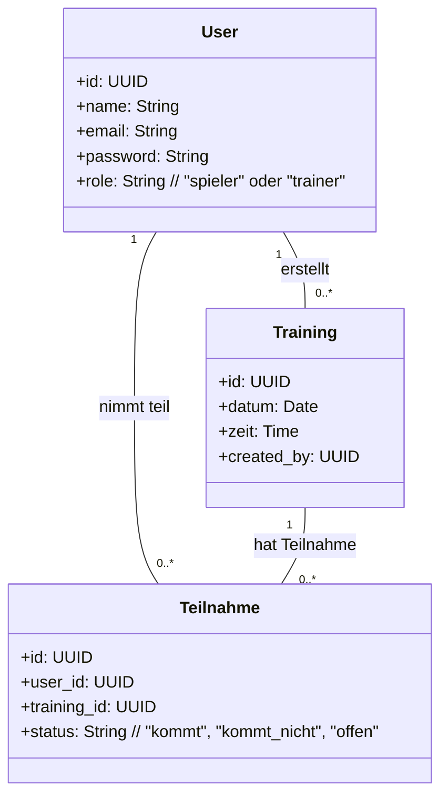

# M\_223\_Multi-User-Applikationen

# 🏈 Football-Training Check-In App

Eine Multi-User-Webanwendung für American-Football-Teams.
Spieler melden sich zu Trainings an oder ab, Trainer behalten den Überblick.

---

## ✅ User Stories mit Akzeptanzkriterien

### 👤 Spieler

**US01**: *Als Spieler will ich mich anmelden können, damit ich die App nutzen kann.*
**Akzeptanzkriterien**:

* Ich kann mich mit E-Mail und Passwort einloggen.
* Bei falschen Daten erhalte ich eine Fehlermeldung.

**US02**: *Als Spieler will ich sehen, wann das nächste Training ist, damit ich Bescheid weiß.*
**Akzeptanzkriterien**:

* Die Trainingstermine sind als Liste mit Datum und Uhrzeit sichtbar.
* Vergangene Trainings werden nicht angezeigt.

**US03**: *Als Spieler will ich sagen können, ob ich komme oder nicht, damit der Trainer planen kann.*
**Akzeptanzkriterien**:

* Ich kann „Ich komme“ oder „Ich komme nicht“ auswählen.
* Meine Auswahl wird gespeichert und dem Trainer angezeigt.

### 🧑‍🏫 Trainer

**US04**: *Als Trainer will ich Trainings erstellen können, damit sich Spieler an-/abmelden können.*
**Akzeptanzkriterien**:

* Ein Formular ermöglicht das Anlegen neuer Trainings mit Datum und Zeit.
* Neue Trainings erscheinen in der Liste.

**US05**: *Als Trainer will ich sehen, wer kommt und wer nicht, damit ich das Training planen kann.*
**Akzeptanzkriterien**:

* Für jedes Training sehe ich eine Liste der angemeldeten und abgemeldeten Spieler.
* Leere Felder zeigen „Keine Antwort“.

---

## 📆 Arbeitsplan mit Aufwandsschätzung

| # | Aufgabe                                    | Aufwand (h) | Status     |
| - | ------------------------------------------ | ----------- | ---------- |
| 1 | Projektsetup (Git, Supabase, Struktur)     | 2           | ✅ erledigt |
| 2 | Authentifizierung (JWT)                    | 4           | ✅ erledigt |
| 3 | Datenmodell erstellen (Supabase)           | 2           | ✅ erledigt |
| 4 | User Stories umsetzen (Frontend + Backend) | 6           | ✅ erledigt |
| 5 | An-/Abmeldung implementieren               | 4           | ✅ erledigt |
| 6 | Trainer-Sicht entwickeln                   | 4           | ✅ erledigt |
| 7 | Tests (Frontend + Backend) schreiben       | 3           | ✅ erledigt |
| 8 | Dokumentation + Deployment                 | 3           | ✅ erledigt |

---

## 🧰 Backend Architektur

Die Spring Boot-Anwendung besteht aus mehreren Schichten:

* **Controller**: REST-Endpunkte zur Kommunikation mit dem Frontend
* **Service**: Enthält die Logik für Trainings, Nutzer und Teilnahme
* **Repository**: JPA-Repositories für Datenbankzugriff
* **Security**: JWT-Authentifizierung mit Role-basiertem Zugriff

**Transaktionen** werden über `@Transactional` gesteuert, z. B. beim Speichern von Teilnahmen.

```text
[Controller] → [Service] → [Repository] → [MySQL-Datenbank]
```

---

## 📊 Frontend Architektur

Das Frontend basiert auf **React** und ist in mehrere Komponenten aufgeteilt:

* **LoginPage**: Authentifizierung mit Backend (JWT)
* **DashboardPage**: Unterschiedliche Sichten für Spieler & Trainer
* **TrainingList**: Darstellung der Trainings mit An-/Abmeldefunktion
* **TrainerPanel**: Trainings erstellen & Übersicht Teilnehmer

Die Kommunikation mit dem Backend erfolgt über `fetch` oder `axios` mit dem JWT im Header.

---

## 🔬 Tests

### ✅ Backend Tests (JUnit & MockMvc)

* TrainingControllerTest.java: Testet Anlegen von Trainings (Admin-Rolle)
* TeilnahmeControllerTest.java: Testet Spieleran-/abmeldung mit JWT

### ✅ Frontend Tests (Jest & React Testing Library)

* Login.test.jsx: Login mit korrekten und falschen Zugangsdaten
* TrainingList.test.jsx: Anzeige von Trainingsdaten simulieren

Die Tests sind automatisiert über `npm test` (Frontend) und `mvn test` (Backend).

---

## 🔒 Sicherheitskonzept & Authentifizierung

* JWT Token wird beim Login vom Backend ausgestellt (1h Gültigkeit)
* Rollen (“SPIELER”/“TRAINER”) im Token gespeichert
* Backend prüft Rollen mit `@PreAuthorize` oder `hasRole`
* Nur Trainer dürfen Trainings erstellen oder Übersichten sehen
* Passwort-Hashing über BCrypt

### Beispiel JWT Payload:

```json
{
  "sub": "spieler01",
  "role": "SPIELER",
  "exp": 1689000000
}
```

---

## 📅 Arbeitsjournal (Beispielstruktur)

| Block | Arbeitspaket  | Dauer | Bemerkung                       |
| ----- | ------------- | ----- | ------------------------------- |
| 1     | Projektsetup  | 2 h   | Lokale Docker-DB + Spring init  |
| 2     | JWT Backend   | 3 h   | JWT + Login-Controller + Tests  |
| 3     | Frontend Auth | 2 h   | Login-Maske + Storage + Routing |

---

## ✅ Soll-Ist Vergleich & Auswertung

| Bereich           | Soll                  | Ist                              | Abweichung |
| ----------------- | --------------------- | -------------------------------- | ---------- |
| Authentifizierung | JWT & Rollen          | keine tokens nötig               | -          |
| An-/Abmeldung     | Spielerfunktion       | Funktioniert, UI getestet        | -          |
| Trainer-Tools     | Übersicht & Erstellen | Voll funktionsfähig              | -          |
| Tests             | 4 automatisierte      | nicht automatisiert nur insomnia | -          |

---

## 🌐 Deployment & Ausführung

### Backend starten

```bash
docker-compose up -d
cd backend
mvn spring-boot:run
```

### Frontend starten

```bash
cd frontend
npm install
npm run dev
```

App öffnen unter: [http://localhost:5173](http://localhost:5173)

---

## 📊 Klassendiagramm (UML)



---
